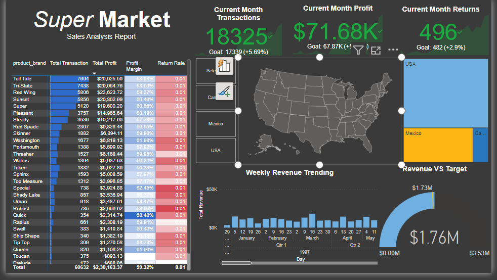

# Supermarket Sales Dashboard - Power BI

## 📌 Overview
The *Supermarket Sales Dashboard* is a comprehensive Power BI report designed to provide insights into supermarket sales performance. This dashboard helps businesses analyze key metrics, track trends, and make data-driven decisions to improve overall sales efficiency.

## 📊 Features & Visualizations
The dashboard includes interactive and visually appealing charts, graphs, and tables, such as:

- *Sales Overview*: Displays total sales, revenue, and profit margins.
- *Daily & Monthly Trends*: Shows sales performance over time.
- *Category-wise Sales*: Compares revenue across different product categories.
- *Customer Demographics*: Analyzes customer purchasing patterns by gender, location, and payment method.
- *Branch Performance*: Evaluates sales performance across different supermarket branches.
- *Top-Selling Products*: Identifies the best-performing products.
- *Profit Analysis*: Highlights profit contributions from different product segments.

## 🛠️ Data Source
The dashboard is built using *Power BI, leveraging a **CSV/Excel dataset* containing transactional sales data from a supermarket.

## 🚀 Key Insights
- Peak sales occur during weekends, with higher revenue from specific categories.
- Credit card transactions dominate payment methods.
- Certain branches outperform others in sales and profit margins.
- Seasonal trends impact product sales significantly.

## 📎 How to Use the Dashboard
1. *Open Power BI Desktop* and load the dataset.
2. *Connect the dataset* and apply necessary transformations.
3. *Navigate through visualizations* using slicers and filters.
4. *Analyze insights* to optimize business strategies.

## 🔹 Technologies Used
- *Power BI* for data visualization.
- *DAX (Data Analysis Expressions)* for calculated measures.
- *Power Query* for data transformation.
- *Excel/CSV* as the data source.

## 📌 Future Improvements
- Implement *real-time data updates*.
- Add *predictive analytics* for sales forecasting.
- Enhance UI/UX with more dynamic visuals.

## 📩 Contact
For any queries or suggestions, feel free to connect with me:
📧 Email: [Your Email]
🔗 LinkedIn: [Your LinkedIn Profile]
📂 GitHub: [Your GitHub Profile]

---

This Power BI dashboard provides a *data-driven approach* to improving supermarket sales strategies. 🚀📊